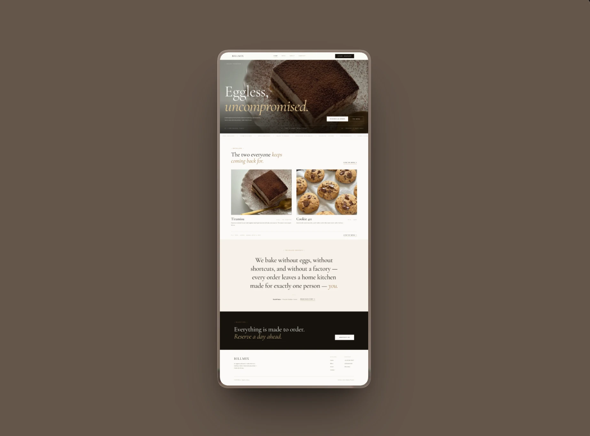
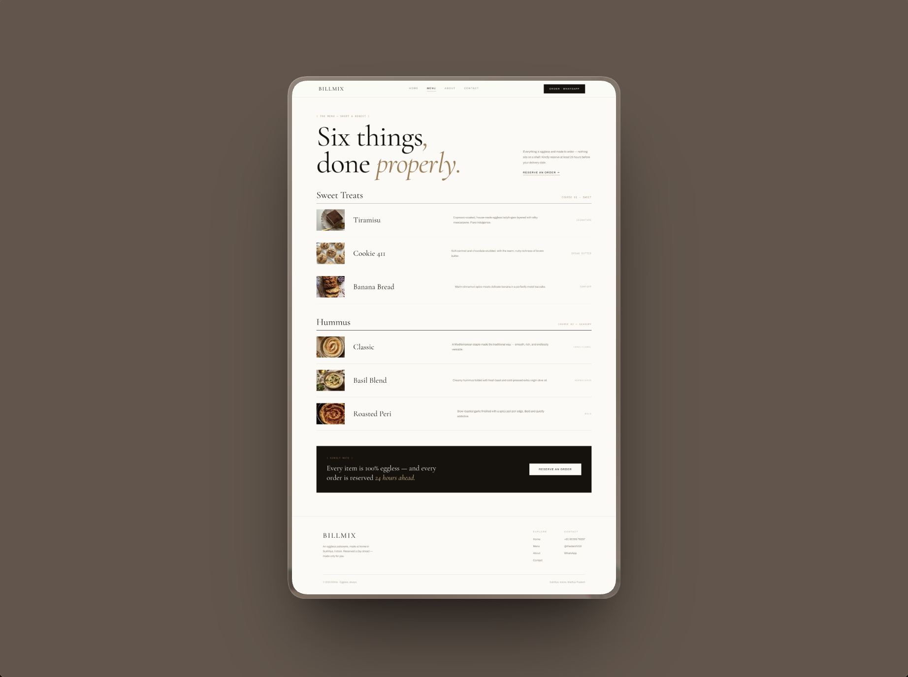
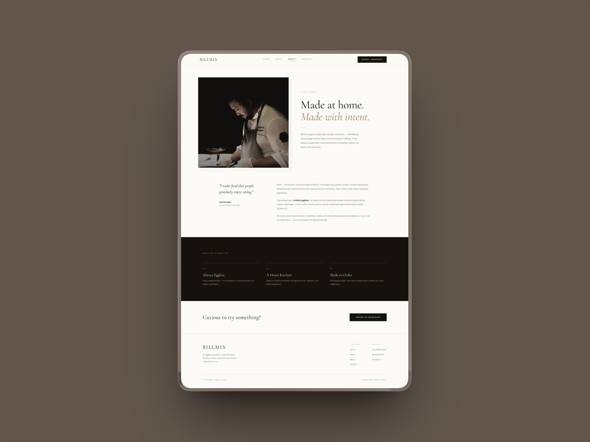
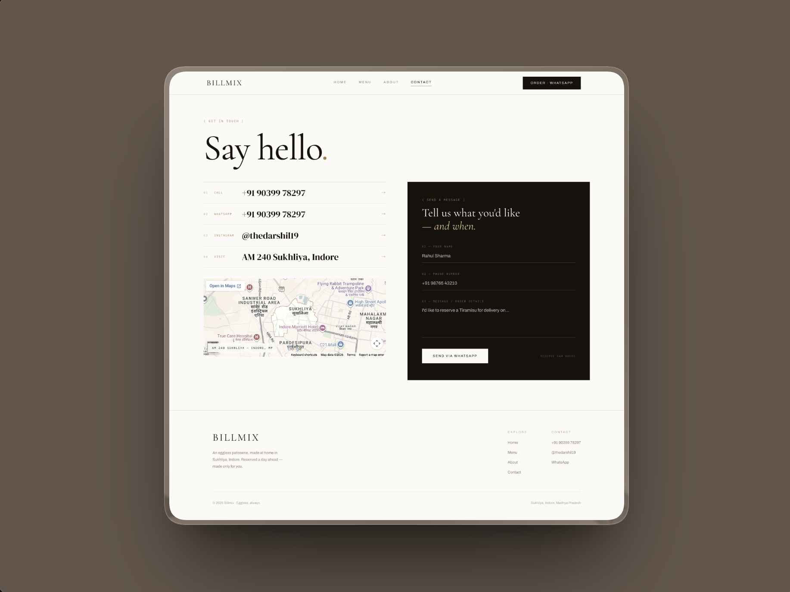

# Billmix — Premium Food & Restaurant React Template

A premium, editorial-quality website template for food businesses — bakeries, patisseries, cafes, and home chefs. Built with React + Vite + Tailwind CSS v4. Every detail is intentional: the typography, spacing, copy voice, and interactions are designed to feel like a magazine, not a website builder.

**Live Demo:** [bakery-website-tawny.vercel.app](https://bakery-website-tawny.vercel.app/)

---

## What's Included

**4 fully designed pages:**
- **Home** — Full-screen hero, marquee credo strip, featured product cards, manifesto section, CTA
- **Menu** — Editorial product list with hover image zoom, category sections, order CTA
- **About** — Founder photo with decorative frame, story section, values grid
- **Contact** — Clickable contact rows, embedded map, WhatsApp order form

**Features:**
- Fully responsive — mobile, tablet, desktop
- Mobile hamburger menu with smooth animation
- Scroll-reveal animations on all sections
- Hover effects on all interactive elements
- WhatsApp ordering wired throughout (navbar, CTAs, contact form)
- Google Maps embed on Contact page
- SEO meta tags + Open Graph tags on every page (react-helmet-async)
- WebP images with lazy loading for fast load times
- Security headers (X-Frame-Options, X-XSS-Protection, Referrer-Policy)
- Vercel-ready with Speed Insights

**Tech stack:**
- React 18
- Vite 6
- Tailwind CSS v4 (via @tailwindcss/vite)
- React Router v6
- react-helmet-async

---

## Screenshots

| Home | Menu |
|------|------|
|  |  |

| About | Contact |
|-------|---------|
|  |  |

---

## Getting Started

```bash
npm install
npm run dev
```

Open [http://localhost:5173](http://localhost:5173) in your browser.

---

## Customization Guide

### 1. Bakery name, tagline, and copy
Search for `[BAKERY NAME]`, `[BAKERY TAGLINE]`, `[FOUNDER NAME]` across all files in `src/pages/` and `src/components/`. Replace with your own content.

Key files:
- `src/components/Navbar.jsx` — nav brand name
- `src/components/Footer.jsx` — footer brand name and copyright
- `src/pages/Home.jsx` — hero copy, CTA text
- `src/pages/Menu.jsx` — menu items, descriptions
- `src/pages/About.jsx` — founder story, values
- `src/pages/Contact.jsx` — contact info rows

### 2. Colors
All colors are inline styles. The palette:
```
Background:  #FBFAF6  (off-white/cream)
Dark:        #16120D  (near-black)
Gold accent: #A07C4F  (warm gold)
Muted text:  #8B8071
Border:      #E7E1D4
```
To change the accent color, find-and-replace `#A07C4F` across `src/`.

### 3. Photos
In each page file, photo variables are declared at the top with a `// TEMPLATE:` comment. Replace the Unsplash URLs with your own hosted image URLs, or swap back to local imports.

For local images:
```js
// Change this:
const tiramisu = 'https://images.unsplash.com/...'
// To this:
import tiramisu from '../assets/your-photo.webp'
```

Put your images in `src/assets/`. WebP format recommended for best performance.

### 4. Menu items
In `src/pages/Menu.jsx`, edit the `menuSections` array:
```js
const menuSections = [
  {
    category: 'Your Category Name',
    course: 'COURSE 01 — LABEL',
    items: [
      { name: 'Item Name', tag: 'YOUR TAG', img: yourImage, desc: 'Your description here.' },
    ],
  },
]
```

### 5. Contact info and WhatsApp number
In `src/pages/Contact.jsx`, edit the `contactRows` array:
```js
const contactRows = [
  { mono: '01', label: 'Call',      value: '+91 XXXXX XXXXX',  href: 'tel:+91XXXXXXXXXX' },
  { mono: '02', label: 'WhatsApp',  value: '+91 XXXXX XXXXX',  href: 'https://wa.me/91XXXXXXXXXX' },
  { mono: '03', label: 'Instagram', value: '@yourhandle',       href: 'https://instagram.com/yourhandle' },
  { mono: '04', label: 'Visit',     value: 'Your Address',      href: 'https://maps.google.com/?q=Your+Address' },
]
```

Also update the WhatsApp number in the `handleSubmit` function:
```js
window.open(`https://wa.me/91XXXXXXXXXX?text=${text}`, '_blank')
```

### 6. Google Maps embed
In `src/pages/Contact.jsx`, update the iframe `src`:
```jsx
src="https://maps.google.com/maps?q=Your+Full+Address&output=embed"
```

### 7. SEO meta tags
Each page has a `<Helmet>` block at the top. Update the `title`, `description`, `og:image`, and `canonical` href for your domain.

---

## Deployment on Vercel

1. Push your code to a GitHub repository
2. Go to [vercel.com](https://vercel.com) → New Project → Import your GitHub repo
3. Click **Deploy** — Vercel auto-detects Vite, no config needed

To connect a custom domain: Vercel Dashboard → your project → Settings → Domains → Add.

---

## License

Personal & Commercial Use — you may use this template for personal projects and client work. Redistribution or resale of the template itself (modified or unmodified) is not permitted.
